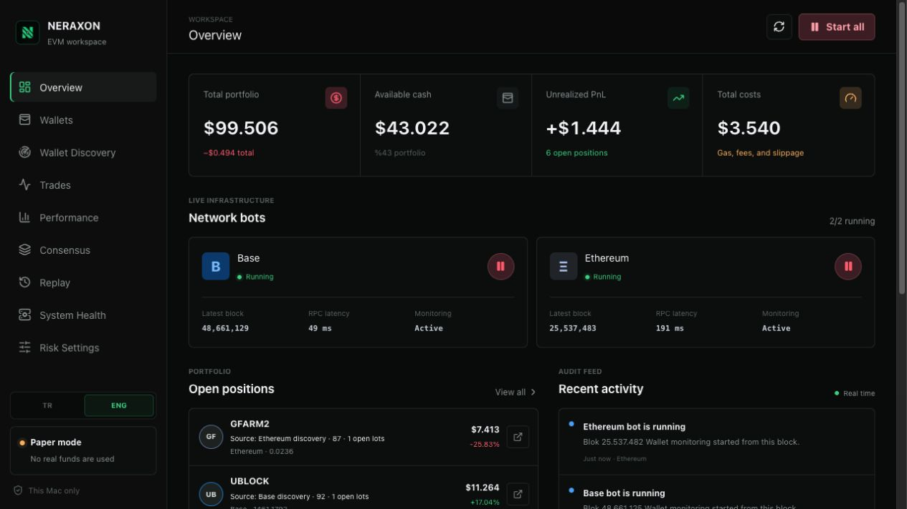

<p align="center">
  
</p>

# NERAXON

NERAXON is a modular trading intelligence application that monitors successful wallets on Ethereum and Base, copies eligible swaps into a paper portfolio under configurable risk rules, and lets you manage the entire process from a local web dashboard. Its architecture is ready for an AI-assisted decision layer in V2.

> V1 operates exclusively in paper trading mode. It does not use real funds or private keys.



## Features

- **Wallet monitoring:** Monitors added EVM wallets on-chain; monitoring can be paused or removed entirely.
- **Copy trading:** Resolves swaps made by tracked wallets and applies eligible trades to the paper portfolio.
- **Smart wallet discovery:** Scans the top-performing tokens from the last 24 hours, finds profitable wallets, and scores them.
- **Multi-wallet signals:** Executes staged buys when 1, 3, 7, and 15 distinct wallets signal the same token.
- **Wallet-based positions:** Associates every buy and sell decision with the source wallet that initiated the trade.
- **Risk engine:** Enforces position size, liquidity, slippage, price impact, volatility, and portfolio concentration limits.
- **Realistic paper execution:** Simulates DEX fees, gas, slippage, price impact, and token taxes.
- **Manual trading:** Resolves token metadata from a contract address and supports percentage-based sales from open positions.
- **Performance tracking:** Displays PnL, costs, and win rates by portfolio, token, wallet, and network.
- **Replay:** Re-evaluates recorded trades under different fee and slippage conditions.
- **Telegram notifications:** Reports swaps, copy decisions, errors, and system events with detailed context.
- **System health:** Tracks latency and errors for RPC providers, DexScreener, Telegram, and other services.
- **TR / ENG support:** Supports both languages across the web dashboard, audit records, and Telegram messages.
- **Local data storage:** Stores settings, trades, and portfolio data locally in SQLite.

## Technology Stack

- Next.js 16, React 19, and TypeScript
- viem for EVM connectivity
- SQLite (`node:sqlite`)
- DexScreener, Alchemy/EVM RPC, and Etherscan APIs
- Telegram Bot API

## Installation

Requirements: Node.js 22+ and npm.

```bash
git clone https://github.com/MustqfaKara/NERAXON.git
cd NERAXON
npm install
cp .env.example .env.local
npm run dev
```

Dashboard: [http://127.0.0.1:3000](http://127.0.0.1:3000)

Configure the Ethereum and Base RPC URLs, Telegram credentials, and optional Etherscan API key in `.env.local`. Never commit real credentials to the repository.

## Commands

```bash
npm run dev        # Start the local development server
npm run build      # Create a production build
npm run typecheck  # Run TypeScript checks
npm run lint       # Run code quality checks
npm test           # Run the test suite
```

## Architecture

The project is divided into network adapters, trading and risk engines, services, a data layer, and the web interface. Additional EVM networks can be integrated through `ChainAdapter` without changing the existing trading or risk logic. See [ARCHITECTURE.md](./ARCHITECTURE.md) for technical details.

## Roadmap

- V1: Paper copy trading on Ethereum and Base
- V1.x: Additional EVM networks and improved discovery/indexer support
- V2: A MiniMax API-powered decision support layer
- Controlled live trading infrastructure after the system has been fully validated

## Disclaimer

This project is intended for educational and research purposes and does not constitute financial advice. Private key management, transaction signing, trading limits, and emergency stop procedures must be independently audited before enabling live trading.
