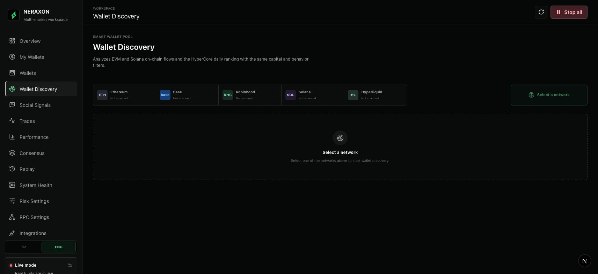

<p align="center">
  
</p>

# NERAXON

NERAXON is a local-first copy-trading and market intelligence workspace for Ethereum, Base, Robinhood Chain, Solana, and Hyperliquid. All five integrations participate in the live monitoring, portfolio, readiness, certification, reconciliation, and copy-trading workflow.

> NERAXON is intentionally designed to run on the operator's own Mac. Do not expose its dashboard or API port to the public internet.



## Supported Integrations

| Integration | Monitoring and discovery | Execution |
| --- | --- | --- |
| Ethereum | EVM swaps and network-scoped wallets | 0x |
| Base | EVM swaps and network-scoped wallets | 0x |
| Robinhood Chain | EVM swaps and network-scoped wallets | Uniswap v4 |
| Solana | Spot swaps across supported DEX activity | Jupiter |
| Hyperliquid | HyperCore spot and perpetual fills | Hyperliquid Exchange API |

## Features

- Network-scoped wallet discovery, scoring, monitoring, and favorites
- EVM execution through 0x and Uniswap v4
- Solana spot execution through Jupiter
- Hyperliquid spot and perpetual execution
- Source-wallet ownership for positions and PnL attribution
- Live balances, realized and unrealized PnL, costs, and reconciliation
- Liquidity, slippage, fee, exposure, daily-loss, and circuit-breaker controls
- Stablecoin filtering and token safety checks
- Telegram notifications and optional Telegram group signal ingestion
- Batched Groq analysis for eligible social signals
- RPC failover, cooldowns, health metrics, and recovery tracking
- Turkish and English dashboard localization
- Local SQLite storage with WAL, integrity checks, and daily backups

## Security

- The web server binds to `127.0.0.1`; it is not reachable from other devices by default.
- Sensitive API routes accept requests only from the local dashboard origin.
- Provider credentials, Telegram credentials, and wallet signing keys are stored in macOS Keychain.
- Stored credentials are never returned to the browser.
- `.env`, `.env.local`, databases, backups, logs, and local trading history are excluded from Git.
- Signing keys can only be changed while every network bot is stopped.
- `LIVE_TRADING_ENABLED` is the final order-submission kill switch.

The repository does not contain operational API keys, private keys, Telegram sessions, or wallet history. Security controls reduce risk but do not make live trading risk-free.

## Requirements

- macOS
- Node.js 22 or newer
- npm

## Setup

```bash
git clone https://github.com/MustqfaKara/NERAXON.git
cd NERAXON
npm install
cp .env.example .env.local
npm run dev
```

Open [http://127.0.0.1:3000](http://127.0.0.1:3000), then configure providers, Telegram, AI, and signing accounts from the **Integrations** page. Keep every bot stopped while changing signing credentials.

Live submission remains disabled until this local setting is explicitly enabled:

```env
LIVE_TRADING_ENABLED=true
```

Before enabling it, verify account addresses, balances, RPC health, trade limits, exit routes, circuit breakers, and network certification with amounts you can afford to lose.

## Optional Local Login

The localhost dashboard can run without a login. To add local password protection, set both values below:

```env
NERAXON_ADMIN_PASSWORD=
NERAXON_SESSION_SECRET=
```

Use at least 16 characters for the password and at least 32 characters for the session secret.

## Commands

```bash
npm run dev
npm run build
npm start
npm run typecheck
npm run lint
npm test
npm run telegram:check
```

Both `npm run dev` and `npm start` bind only to `127.0.0.1`.

## Architecture

Chain and venue adapters, deterministic risk engines, execution services, credential custody, persistence, and the Next.js interface are kept separate so new integrations can be added without changing existing execution semantics. See [ARCHITECTURE.md](./ARCHITECTURE.md) for the technical flow.

## Disclaimer

NERAXON can submit real financial transactions and can lose funds through market movement, smart-contract behavior, provider failure, configuration errors, or compromised credentials. Review the code and operating environment independently before using live execution.
