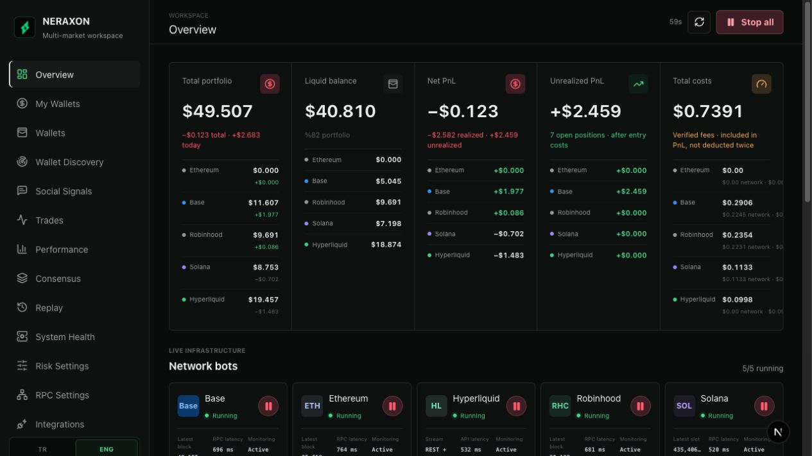
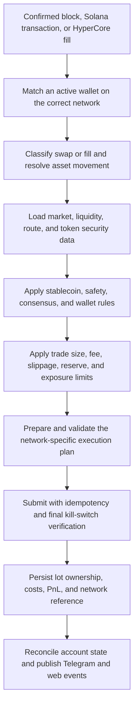

<p align="center">
  
</p>

<h1 align="center">NERAXON</h1>

<p align="center">
  Local-first multi-market copy trading, wallet intelligence, execution safety, and portfolio accounting.
</p>

NERAXON monitors selected wallets, discovers potentially profitable traders, classifies confirmed on-chain activity, and copies eligible trades through network-specific execution adapters. It supports Ethereum, Base, Robinhood Chain, Solana, and Hyperliquid from one local dashboard.

The active runtime is live-only. Every order is still subject to deterministic safety checks, portfolio limits, route validation, idempotency, reconciliation, and an explicit final kill switch.

> NERAXON is designed to run on the operator's own Mac and bind only to `127.0.0.1`. Do not expose the dashboard or API port to the public internet.



## What NERAXON Does

- Discovers and scores wallets independently for each supported network
- Monitors only the networks assigned to each wallet
- Classifies swaps and HyperCore fills from confirmed activity
- Copies eligible buys and source-owned sells
- Tracks which wallet caused each copied position
- Calculates live balances, cost basis, fees, realized PnL, and unrealized PnL
- Executes EVM, Solana, HyperCore spot, and HyperCore perpetual orders
- Rejects stablecoins, unsafe assets, invalid routes, excessive fees, and risky exposure
- Sends operational, trade, and critical notifications to separate Telegram topics
- Accepts authenticated Telegram operator commands with two-step trade confirmation
- Analyzes eligible Telegram social signals in controlled Groq batches
- Records execution attempts, audit events, reconciliation, and service health locally

## Supported Integrations

| Integration | Discovery and monitoring | Execution | Funding asset |
| --- | --- | --- | --- |
| Ethereum | EVM swaps and network-scoped wallets | 0x with validated route fallbacks | ETH |
| Base | EVM swaps and network-scoped wallets | 0x with validated route fallbacks | ETH |
| Robinhood Chain | EVM swaps and network-scoped wallets | Uniswap v4 and validated Portal routes | ETH |
| Solana | Spot activity across supported DEX flows | Jupiter | SOL |
| Hyperliquid | HyperCore spot and perpetual fills | Hyperliquid Exchange API | USDC |

Non-swap transfers, approvals, liquidity operations, stale subscription snapshots, and unsupported contract calls are not copied.

## Copy-Trade Flow


```mermaid
flowchart TD
    A["Confirmed block, Solana transaction, or HyperCore fill"] --> B["Match an active wallet on the correct network"]
    B --> C["Classify swap or fill and resolve asset movement"]
    C --> D["Load market, liquidity, route, and token security data"]
    D --> E["Apply stablecoin, safety, consensus, and wallet rules"]
    E --> F["Apply trade size, fee, slippage, reserve, and exposure limits"]
    F --> G["Prepare and validate the network-specific execution plan"]
    G --> H["Submit with idempotency and final kill-switch verification"]
    H --> I["Persist lot ownership, costs, PnL, and network reference"]
    I --> J["Reconcile account state and publish Telegram and web events"]
```

Copied positions use source ownership:

- A copied buy creates an execution lot linked to the wallet that triggered it.
- A sell from another wallet cannot close that lot.
- Multiple wallets buying the same asset follow the configured consensus progression.
- Manual exits reduce the correct FIFO cost basis and preserve source-wallet PnL attribution.
- Stablecoin movements do not create copy signals or count toward swap activity limits.

## Wallet Discovery

Wallet discovery combines market context with confirmed ownership data. DexScreener, Birdeye, and GeckoTerminal identify active or gaining markets; chain data is then used to reconstruct actual buyers and sellers.

Candidates are evaluated using:

- Realized and unrealized PnL
- PnL relative to deployed capital
- Win rate and completed round trips
- Swap count and activity density
- Market diversity and freshness
- Capital range and copyability
- Liquidity, volume, and market quality
- Suspicious transfer, token, and behavior signals

Discovery intentionally favors active degen-scale wallets over accounts deploying millions of dollars for relatively small percentage returns. Wallets are saved with their discovery evidence and remain scoped to the network where they qualified. Favoriting a compatible wallet expands monitoring according to address-format rules.

Hyperliquid discovery uses the daily leaderboard and recent `userFills` history. Only fills received after the live subscription starts are eligible for copying.

## Dashboard

| Page | Purpose |
| --- | --- |
| Overview | Portfolio equity, available balance, network PnL, recent activity, and bot controls |
| My Wallets | Assets held by each configured execution account |
| Wallets | Network-scoped watchlists, status, favorites, copy count, activity, and attributed PnL |
| Wallet Discovery | Gaining markets, candidate wallets, evidence, scores, and follow actions |
| Social Signals | Telegram token mentions, resolved market data, and batched AI opinions |
| Trades | Manual execution, network-grouped open positions, source wallets, and trade history |
| Performance | Token, wallet, network, PnL, cost, and execution-quality analytics |
| Consensus | Multi-wallet confirmation state for repeated asset entries |
| Replay | Historical monitoring and classification inspection |
| System Health | Provider health, circuit breakers, reconciliation, and certification state |
| Risk Settings | Network execution limits, asset policy, allowlists, and denylists |
| RPC Settings | Primary and fallback RPC endpoints with masked credentials and health state |
| Integrations | API providers, Telegram, AI, execution accounts, and credential status |

Each page has its own URL and requests only the data needed for that view.

## Execution And Accounting

NERAXON uses a shared `prepare -> validate -> execute -> account -> reconcile` lifecycle while keeping chain-specific behavior in separate adapters.

Execution records include:

- Quote and execution price
- Expected and minimum output
- Slippage and price impact
- Network and venue fees
- Submission and confirmation state
- Transaction hash or external order ID
- Accounting and reconciliation status
- Source wallet, asset, network, and timestamps

Live portfolio accounting separates:

- Execution-account equity
- Available balance
- Open position value or allocated margin
- Current market exposure
- Realized and unrealized PnL
- Network, DEX, funding, and execution costs
- Deposits and withdrawals that must not be treated as trading PnL

Hyperliquid unified-account values are handled separately from local lot margin and notional exposure to avoid double-counting collateral or perpetual PnL.

## Risk And Safety

New entries can be rejected by any of the following controls:

- Per-network minimum and maximum trade size
- Position allocation range
- Maximum open positions
- Token and source-wallet exposure
- Cash or gas-token reserve
- Daily loss threshold
- Network fee and fee-to-trade ratio
- Slippage and price-deviation limits
- Quote freshness
- Liquidity, volume, and open-interest requirements
- Contract target and route validation
- EVM honeypot and token-security checks
- Jupiter Shield and Solana token-authority checks
- Automatic asset filtering and manual denylist
- Circuit breaker and unresolved reconciliation

Exit orders remain available when an entry-only limit is reached, allowing risk to be reduced. Final live submission also requires:

```env
LIVE_TRADING_ENABLED=true
```

Turning this setting off prevents adapters from submitting new live orders even if a higher-level service requests one.

## Telegram

NERAXON supports a forum-enabled Telegram group with separate topics:

| Topic | Content |
| --- | --- |
| General | Full operational event stream |
| Buy & Sell | Completed trade details, source wallet, price, market cap, PnL, and market link |
| Important | Critical failures and operator-relevant warnings |
| Info | Authenticated balance, status, position, and trading commands |

The Info topic accepts commands only when all three values match:

- Configured Telegram group ID
- Configured Info topic ID
- Authorized numeric Telegram user ID

Trade commands create a pending action and require an inline confirmation within 60 seconds. They use the same execution and risk engine as the dashboard.

### Telegram Commands

| Command | Example | Result |
| --- | --- | --- |
| `/balance` | `/balance` | Compact portfolio and network balance summary |
| `/pnl` | `/pnl` | Realized, unrealized, daily, and net PnL |
| `/positions` | `/positions` | Open positions with 25%, 50%, and 100% sell buttons |
| `/status` | `/status` | Bot and network latency state |
| `/recent` | `/recent` | Recent execution attempts |
| `/limits` | `/limits` | Current network execution limits |
| `/quote` | `/quote base 0x...` | Market and token-safety summary |
| `/buy` | `/buy base 0x... 4` | Prepare a 4 USD EVM buy |
| `/sell` | `/sell solana <mint> 50` | Prepare a 50% position sale |
| `/buy` | `/buy hyperliquid perp HYPE long 12 2` | Prepare a 12 USD, 2x HyperCore perp entry |
| `/sellall` | `/sellall base` | Prepare full exits for one network |
| `/pause` | `/pause base` | Stop one network bot |
| `/resume` | `/resume base` | Start one network bot |

Telegram's native command menu is registered automatically. Close command typos such as `/bala` produce a suggested `/balance` action.

## Social Signals And AI

An optional Telegram user session can read one explicitly configured source group that cannot accept the bot account. Messages are resolved into token signals, enriched with market data, and displayed in Social Signals.

Groq requests are batched to reduce token usage. Only eligible ticker or token signals that pass deterministic market prefilters are sent for AI analysis. AI output is advisory and does not bypass execution safety controls.

## Security Model

- The server binds to `127.0.0.1`.
- Mutating API routes enforce same-origin localhost requests.
- Wallet private keys, Telegram sessions, and provider secrets are stored in macOS Keychain.
- Secret values are never returned to the browser after storage.
- Signing credentials can only be changed while all bots are stopped.
- `.env`, `.env.local`, SQLite files, backups, logs, and trading history are excluded from Git.
- Telegram operator commands require chat, topic, and user authorization.
- Pending Telegram trades expire and cannot be replayed after consumption.
- Execution attempts use deterministic idempotency keys.
- Provider target contracts and transaction payloads are validated before submission.

The repository contains no operational API keys, wallet private keys, Telegram sessions, or local trading history.

## Requirements

- macOS
- Apple Silicon or Intel Mac
- Node.js 22 or newer
- npm
- A modern browser
- RPC and execution-provider credentials for the networks you enable
- Funded execution accounts for live trading

## Quick Start

```bash
git clone https://github.com/MustqfaKara/NERAXON.git
cd NERAXON
npm install
cp .env.example .env.local
npm run dev
```

Open [http://127.0.0.1:3000](http://127.0.0.1:3000).

Configure providers, Telegram, AI, public account addresses, and signing credentials from the **Integrations** page. Keep all bots stopped while changing signer credentials.

Before enabling live submission:

1. Verify every displayed execution-account address.
2. Confirm native gas or funding balances.
3. Check primary and fallback RPC health.
4. Review network trade, fee, slippage, and exposure limits.
5. Complete small buy, partial-sell, and full-sell certification flows.
6. Reconcile each network against its explorer or exchange state.
7. Enable `LIVE_TRADING_ENABLED` only after the checks pass.

## Configuration

Copy `.env.example` to `.env.local` and configure only the integrations you use. Main groups include:

- Local authentication and session signing
- EVM primary and fallback RPC endpoints
- Helius and Jupiter for Solana
- Hyperliquid Info, WebSocket, and Exchange endpoints
- 0x, LI.FI, Birdeye, and Etherscan providers
- Telegram bot, group, and forum-topic IDs
- Groq advisory model settings
- macOS Keychain account aliases

The Integrations page is preferred for sensitive values. Environment variables are useful for local development, but `.env.local` must never be committed.

### Optional Local Login

```env
NERAXON_ADMIN_PASSWORD=
NERAXON_SESSION_SECRET=
```

Use at least 16 characters for the password and at least 32 characters for the session secret.

### Telegram User Session

```bash
npm run telegram:login
npm run telegram:check
npm run telegram:forums
```

The session, API ID, and API hash are stored in Keychain. `telegram:forums` lists available forum and topic IDs without printing session secrets.

## Local Data

NERAXON uses SQLite with WAL mode. Startup performs integrity checks and WAL maintenance. Daily backups are written under `data/backups/` with bounded retention.

Local storage includes wallet evidence, execution lots, attempts, trades, events, settings, service health, reconciliation, and certification results. The complete `data/` directory is excluded from Git.

## Development

```bash
npm run dev
npm run typecheck
npm test
npm run lint
npm run build
npm start
```

Both development and production servers bind to `127.0.0.1`.

The main code boundaries are:

```text
src/lib/chains       Network connectivity, monitoring, and classification
src/lib/engine       Deterministic scoring, policy, risk, and accounting math
src/lib/execution    Network-specific preparation and order submission
src/lib/services     Orchestration, discovery, reconciliation, AI, and Telegram
src/lib/repositories SQLite persistence and local state
src/app/api          Same-origin API routes
src/components       Dashboard interface
```

See [ARCHITECTURE.md](./ARCHITECTURE.md) for deeper implementation details.

## Operational Limitations

- This project is not intended for public hosting or multi-user custody.
- Market-data and RPC providers can rate-limit, delay, or return incomplete data.
- Discovery scores are behavioral heuristics, not proof of future profitability.
- Token safety checks reduce risk but cannot guarantee that an asset is safe.
- Copy trades can execute at a different price from the source wallet.
- Low-liquidity exits can fail or produce severe slippage.
- Hyperliquid collateral, margin, and notional exposure are different accounting values.
- Manual wallet activity outside NERAXON may require position reconciliation.

## Contributing

Contributions are welcome. Read [CONTRIBUTING.md](./CONTRIBUTING.md) before opening an issue or pull request. Report security vulnerabilities privately according to [SECURITY.md](./SECURITY.md).

## License

NERAXON is open-source software licensed under the [MIT License](./LICENSE).

## Disclaimer

NERAXON can submit real financial transactions and can lose funds through market movement, smart-contract behavior, malicious tokens, provider failure, exchange behavior, configuration errors, or compromised credentials. Review the code, limits, and operating environment independently. Use only funds you can afford to lose.
